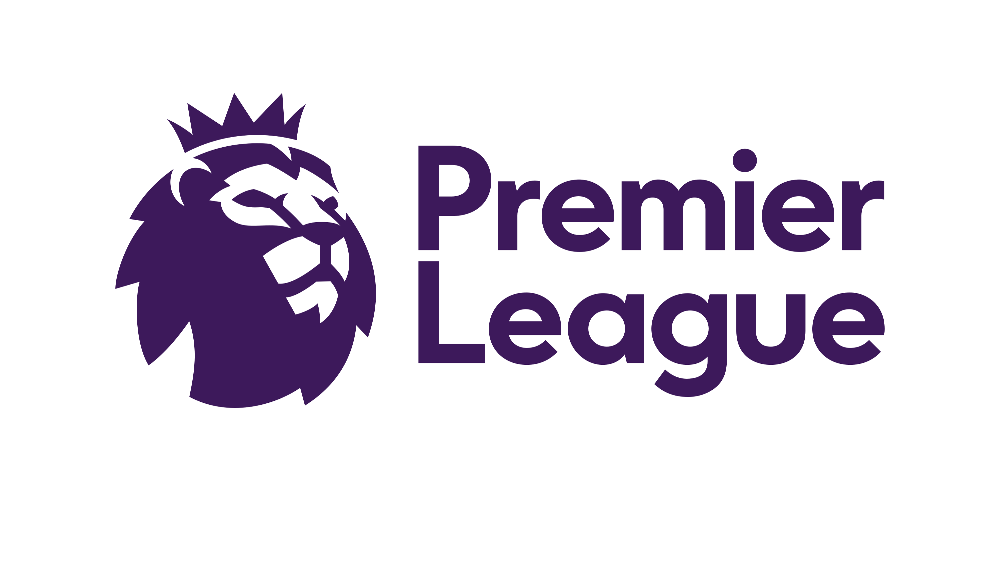

<h1>Memoria del proyecto fin de evaluación de Lenguajes de Marcas - 1º DAW</h1>
<h2>Premier League Website</h2>
<h2>Indice</h2>
<ul>
  <li><a href="#introduccion">Introducción</a></li>
  <li><a href="#motivacion">Motivación</a></li>
  <li><a href="#estructura">Estructura</a></li>
  <li><a href="#estilo">Estilo</a></li>
</ul>

<h2 id="introduccion">Introducción</h2>

Trabajo realizado en clase por: Antonio González Mayorga

Proyecto de web "from scratch" de 1ª evaluación de Lenguajes de Marcas

Diciembre de 2023 

Licencia CC-BY

<h2 id="motivacion">Motivación</h2>

Me he decantado por este tema ya que me apasiona el fútbol y la Premier League es una liga muy atractiva para el espectador. Además de poder hacer la web en inglés.

<h2 id="estructura">Estructura</h2>

La web está dividida en 6 secciones y el footer:

<ul>
  <li>Hero Section</li>
  <li>Introducción</li>  
  <li>Galería de equipos</li>
  <li>Cards con información</li>
  <li>Mapa</li>
  <li>Acordeón de rivalidades</li>
  <li>Footer</li>
  </ul>

<h3>Hero Section</h3>

He utilizado varias imagenes en la Hero Section intentando adaptarla a la mayoría de dispositivos. 
Las imagenes están sacadas de Google Imagenes 
También hay un botón con el texto "Get Started!" el cual al ser presionado dará comienzo al viaje por la página 

<h3>Introducción</h3>

En la introducción he intentado explicar brevemente que es la Premier League. En caso de que faltara información, hay un botón que redirecciona a Wikipedia, pudiendo entender de mejor manera que es dicha liga

<h3>Galería de equipos</h3>

He puesto 20 imagenes, cada una con el escudo de cada equipo, y además, al presionar un escudo, te redirecciona a la página oficial de dicho equipo.

<h3>Mapas</h3> <iframe src="https://www.google.com/maps/d/embed?mid=1WxTzRcZFS9WMLgBF8-_cg8NVX-c&ehbc=2E312F" frameborder="0" style="border:0; width: 100%; height: 60vh;" allowfullscreen="" loading="lazy"></iframe>

He usado este ifram para mostrar un mapa con escudos en sus respectivos estadios para hacer saber al espectador donde se situa cada equipo.

<h3>Acordeón de rivalidades</h3>

He añadidio un acordeón comentando las mayores rivalidades en el fútbol inglés, como los rivales clásicos o los derbys de ciudad.

<h3>Footer</h3>

Footer de w3schools personalizado por mi

<h2 id="estilo">Estilo de la página</h2>
<h3>Paleta de colores</h3>

#05f0ff, #41a5ff, #617cff, #6578ff, #7467ff, #ffffff, #000000, #3D195B
<h3>Imágenes</h3>

Imágenes obtenidas de Google Imagenes, https://www.premierleague.com/, pinterest...

<h2 id="snippets">Code snippets</h2>

He utilizado los siguientes:

<ul>
  <li>Barra de navegación: w3schools</li>
  <li>Cards: w3Schools</li>
  <li>Acordeón: codeopen.io</li>
  <li>Footer: w3Schools</li>
  <li>Todo ha sido personalizado respetando la responsividad y la gama de colores.</li>
</ul>
